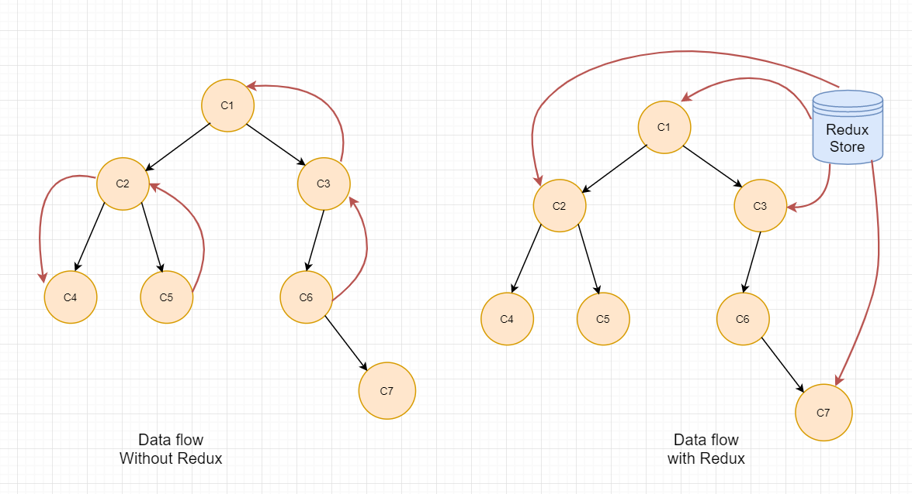

# LABORATORY-REDUX-SAGA-THUNK

This laboratory is an experiment of **Redux-Saga** in comparison with **Redux-Thunk** in two **React** applications. Both are used to enhance the functionnalities of Redux by allowing the use of asynchronous actions.

The goal of this laboratory was to show the limit of Redux-Thunk when orchestration are needed between two events such as the incrementation and decrementation of a counter with concurrency.

## Redux



When we want to pass information from one component to another component, we dont have a lot choice. Either we can rely on the context Api of react or either we pass the information through props.

When the number of component involve is relatively low and when the components are close in the tree, we generally pass the information using the props.

In the other case, we rely on context API. This is simple to put in place. But even this feature have limit. If the number of refresh/update is high, context start to be overload. On top of that, the organization of the code with context can get pretty messy quickly.

In those cases, we generally use a Redux Store where we will store our data and will pull them in our application. Action will be use to modify the information in the Store.

## Redux-Thunk

### Theory


The principle of Redux-Thunk is quite simple from the schema above.

When the user click on a button on the app, an event is trigger and sent to out middlware by the dispatcher. Once received, the request is sent to the api and till we wait for the completion before going further. Once the call is done, the final update is sent to the store with the actual value inside. And finally the front is updated with the new state.

One of the problem of this schema is when multiple event arrive and the time of response from the api are different for each event. In those case, we have a race problem between our events. See the experiences for more information.

### Experiences

#### Experience 1

The goal of experience 1 was to show how to use the middleware for handling the side-effect. This example also shows up the problem of React Redux when hangling call happening concurently.

Redux Thunk does not have a queue and does not pause his execution. Because of that, the state for processing a call is the one when the action arrive at the middleware. A problem appear in this case. For example,

0- The counter is at 0
1- The user clicks on increment, the middleware will handle the call on 3 seconds. The resultat expected will be 1.
2- Before the previous call is fullfilled. The user click on decrement. This call will also take 3 seconds. The resultat expected in this case is 0 since we have done that after the incrementation.
3- The counter goes to 1
4- The counter goes to -1

The counter at the moment of decrementing took in account, the value of the state the moment I pressed the decrement button. At this moment, the value was 0. It did not care about the incrementation at all.

#### Experience 2

Experience2 is a fix of the previous problem using the ThunkApi to call the state for getting the result of the actual state.

0- The counter is at 0
1- The user clicks on increment, the middleware will handle the call on 3 seconds. The resultat expected will be 1.
2- Before the previous call is fullfilled. The user click on decrement. This call will also take 3 seconds. The resultat expected in this case is 0 since we have done that after the incrementation.
3- ThunkApi get the actual state for the first call
4- The counter goes to 1
5- ThunkApi get the actual state for the second call
6- The counter goes to 0

In this case, it will work. But getting the last state is not a proper solution. In the case, where the call have different response time and something happen we are doom.

#### Experience 3

Experience3 is how tricky event can be. In this example, a message appears if the count reaches 3. The time for the call are different. When you decrease, it takes 5 seconds but when it increase, it takes 2 seconds. Unexpected behaviors arrive in some cases:

0- The counter is at 1
1- One user click on increase
2- Another user click on decrease before the previous call ended
3- Another user click on increase before any of the other call ended
4- We are expecting to see the counter move from 1 digit at most. However, since the increase is way faster than the decrease. The message for reaching 3 will be shown.

The only solution is really to create a queue in react-redux.

## Redux-Saga

### Theory


Redux-Saga is close to Redux-Thunk but the management of the saga with generator function modify completely how the request are handle.

Once the action with the payload reaches the middleware. The request is sent to the channel. If multiple are sent, they will be stack there. One saga will be handle when discovered by the watchers. The next yield will be started, the call or whatever the saga does will be handle in our worker. Worker can be synchronous or asynchronous. It give us a lot of control over how to manage the saga between them. Once the result is found, it sent back to our middleware that will dispatch the result to our store for update.

The rest work exactly as Redux-Thunk.

#### Experiences

#### Experience 1

This experience is the same as the experience 3 in React-Thunk. The problem still persist.

#### Experience 2

Using the channels, the calls are now being played in the right order independently from the time for the request to be handle. The UI has not be block during the experience which mean I can still use the other button and the counter will be perfectly updated.

## Running

For starting the two projects at the same time:

```bash
$ nx run-many --target=serve --projects=app-redux-thunk,app-redux-saga
```

## System

Ubuntu Version: Ubuntu 20.04.1 LTS
Node Version: v16.15.1

```bash
# Get the version of node
$ node -v

# Get the latest version of ubuntu
$ lsb_release -a
```
